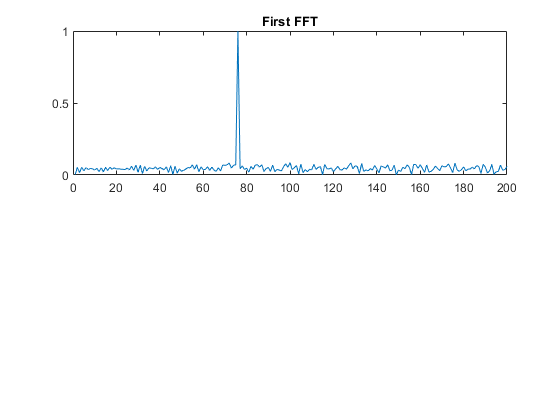
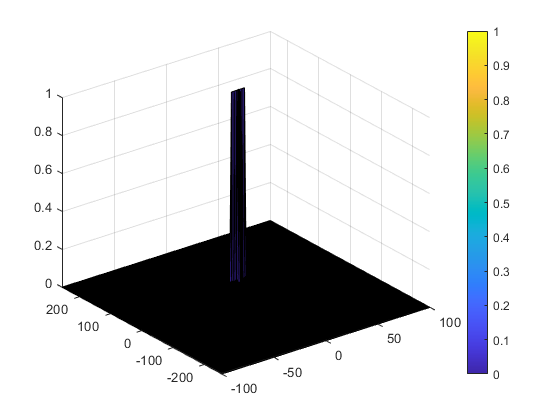

# SFND_radar
# CFAR Implementation Project
### Project Layout

-   Configure the FMCW waveform based on the system requirements.
-   Define the range and velocity of target and simulate its displacement.
-   For the same simulation loop process the transmit and receive signal to determine the beat signal
-   Perform Range FFT on the received signal to determine the Range
-   Towards the end, perform the CFAR processing on the output of 2nd FFT to display the target.

### FMCW waveform design

    B = c/(2*rng_res)
	Tchirp = 5.5*(range_max*2/c)
	slope = B/Tchirp
### Simulation Loop
Simulate Target Movement and calculate mixed signal for every timestamp
```
Tx=zeros(1,length(t)); %transmitted signal
Rx=zeros(1,length(t)); %received signal
Mix = zeros(1,length(t)); %beat signal
```
### Range FFT



### 2D CFAR

```
%Select the number of Training Cells in both the dimensions
Tr = 10;
Td = 5;
%Select the number of Guard Cells in both dimensions around the Cell under
%test (CUT) for accurate estimation
Gr = 5;
Gd = 2;
% offset the threshold by SNR value in dB
offset = 1.2;
```

